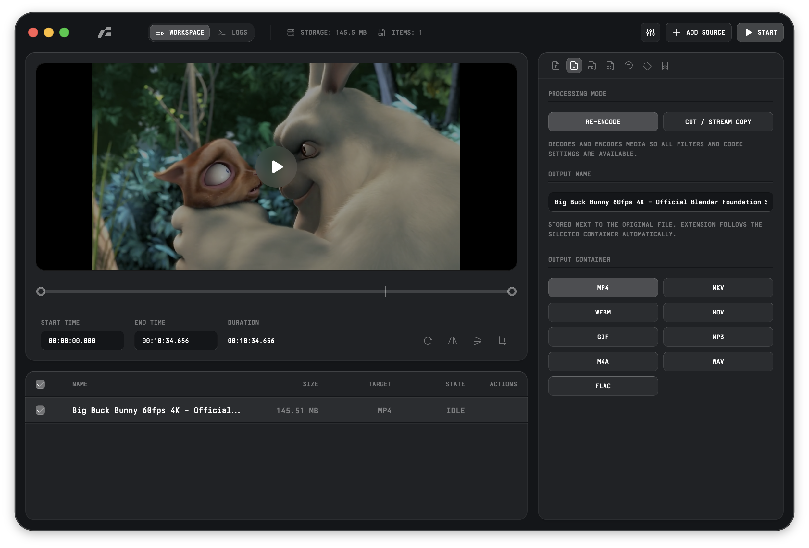

<div align="center">
  
  <h1>Frame</h1>
</div>

<div align="center">
  
  
  
  
  <a href="https://github.com/sponsors/66HEX">
    
  </a>
</div>

**Frame** is a native media conversion utility built in Rust. It provides a
desktop interface for FFmpeg operations, with granular control over video,
audio, image, subtitle, and metadata settings. The application uses a GPUI-CE
front end and a reusable Rust conversion core for FFmpeg argument generation,
source probing, compatibility validation, task control, and progress parsing.

<br />
<div align="center">
  
</div>
<br />

> [!WARNING]
> **Unsigned Application Notice**
> Since the application is currently unsigned, your operating system may flag it:
>
> - **macOS:** The system can flag the app and bundled binaries with a quarantine
>   attribute. To run the app, remove the attribute manually:
>   ```bash
>   xattr -dr com.apple.quarantine /Applications/Frame.app
>   ```
> - **Windows:** Windows SmartScreen may prevent the application from starting.
>   Click **"More info"** and then **"Run anyway"** to proceed.

## GitHub Sponsors

If Frame helps you, consider supporting the project on GitHub Sponsors:

[**Sponsor Frame**](https://github.com/sponsors/66HEX)

Current funding goals:

- **Apple Developer Program:** `$99/year` to sign and notarize macOS builds.
- **Microsoft code-signing certificate:** estimated `$300-$700/year` to sign
  Windows builds and reduce SmartScreen friction.

Sponsor contributions are used first for these release-signing costs.

See [GitHub Sponsors](https://github.com/sponsors/66HEX) for full sponsorship
details, tier suggestions, and a launch checklist.

## Features

### Media Conversion Core

- **Media Types:** Video, audio, and image sources.
- **Supported Source Files:**
  - **Video:** `mp4`, `mov`, `mkv`, `avi`, `webm`, `gif`
  - **Audio:** `mp3`, `m4a`, `wav`, `flac`
  - **Image:** `png`, `jpg`, `jpeg`, `webp`, `bmp`, `tif`, `tiff`, `avif`,
    `heic`, `heif`
- **Supported Output Formats:**
  - **Video:** `mp4`, `mkv`, `webm`, `mov`, `gif`
  - **Audio:** `mp3`, `m4a`, `wav`, `flac`
  - **Image:** `png`, `jpg`, `webp`, `bmp`, `tiff`
- **Video Encoders:**
  - `libx264` (H.264 / AVC)
  - `libx265` (H.265 / HEVC)
  - `vp9` (Google VP9)
  - `prores` (Apple ProRes)
  - `libsvtav1` (SVT-AV1)
  - `gif` palette output
  - **Hardware Acceleration:** `h264_videotoolbox`, `hevc_videotoolbox`,
    `h264_nvenc`, `hevc_nvenc`, `av1_nvenc` when available in the configured
    FFmpeg build.
- **Image Encoders:** `png`, `mjpeg` (JPEG), `libwebp` (WebP), `bmp`, `tiff`.
- **Audio Encoders:** `aac`, `ac3`, `libopus`, `mp3`, `alac`, `flac`,
  `pcm_s16le`, plus optional `libfdk_aac` when available.
- **Bitrate Control:** CRF, target bitrate, audio VBR where supported, and
  codec-specific presets.
- **Video Processing:** Resolution presets, custom dimensions, FPS conversion,
  pixel format selection, scaling, crop, rotate, flip, and image overlay.
- **GIF Controls:** Frame rate, color count, dithering, and loop count.
- **Audio Controls:** Codec, bitrate, VBR quality, channel layout, volume, and
  per-track selection.
- **Subtitles:** Stream selection, `.srt` / `.ass` / `.vtt` source filtering,
  burn-in subtitle file selection, font, size, color, outline color, and
  position controls.
- **Metadata:** Preserve, clean, or replace metadata fields such as title,
  artist, album, genre, date, and comment.
- **Metadata Probing:** Automated source inspection through `ffprobe`.

### Architecture & Workflow

- **Native UI:** GPUI-CE application shell, custom titlebar, workspace/logs
  views, settings panels, and shared UI primitives.
- **Shared Conversion Core:** `frame-core` owns FFmpeg arguments, media rules,
  probing types, filter construction, and validation logic.
- **Concurrent Processing:** Rust task controller for queueing and limiting
  simultaneous FFmpeg processes.
- **Real-time Telemetry:** FFmpeg progress and log events are parsed and shown
  in the app while conversions run.
- **Runtime Binaries:** Local development uses platform-specific FFmpeg and
  FFprobe binaries under `frame-app/resources/binaries/`. Native bundles include
  the same binaries and detect encoder capabilities from the bundled FFmpeg at
  startup.

## Technical Stack

### Native Application

- **Language:** Rust Edition 2024.
- **UI:** GPUI-CE.
- **Native Dialogs:** `rfd`, with extension filtering for supported media and
  subtitle files.
- **Assets:** Embedded SVG icons, bundled Instrument Sans font, and native app
  icon resources for macOS, Windows, and Linux packages.

### Conversion Core

- **Runtime Tools:** FFmpeg and FFprobe.
- **Serialization:** `serde`, `serde_json`.
- **Error Handling:** `thiserror`.
- **Media Rules:** Shared JSON compatibility matrix consumed by Rust code.

## Installation

### Download Prebuilt Binaries

The easiest way to get started is to download the latest release for your
platform directly from GitHub.

[**Download Latest Release**](https://github.com/66HEX/frame/releases)

> **Note:** Since the application is not yet code-signed, you may need to
> manually approve it in your system settings.

### WinGet (Windows)

Frame is available in the official WinGet repository under the `66HEX.Frame`
identifier.

```powershell
winget install --id 66HEX.Frame -e
```

To update:

```powershell
winget upgrade --id 66HEX.Frame -e
```

### Homebrew (macOS)

For macOS users, Frame is available through the custom Homebrew tap:

```bash
brew tap 66HEX/frame
brew install --cask frame
```

### Build from Source

If you prefer to build the application yourself or want to contribute, follow
these steps.

**1. Prerequisites**

- **Rust:** [Install Rust](https://www.rust-lang.org/tools/install)
- **Platform toolchain:** a C/C++ build toolchain and native desktop libraries
  required by Rust and GPUI-CE on your operating system.

**2. Clone the Repository**

```bash
git clone https://github.com/66HEX/frame.git
cd frame
```

**3. Setup Runtime Binaries**

Frame requires FFmpeg and FFprobe runtime binaries. Release and development
tasks download the platform-specific tools into
`frame-app/resources/binaries/`, which is intentionally ignored by git. To
prepare them manually:

```bash
cargo xtask setup-ffmpeg
```

**4. Run or Build**

- **Development:**

  ```bash
  cargo run --manifest-path frame-app/Cargo.toml
  ```

- **Production Build:**

  ```bash
  cargo build --manifest-path frame-app/Cargo.toml --release
  ```

- **Regenerate release workflows:**

  ```bash
  cargo xtask workflows
  ```

- **macOS DMG:**

  ```bash
  cargo install cargo-bundle
  cargo xtask bundle macos
  ```

- **Linux tarball with `.desktop` metadata and hicolor icons:**

  ```bash
  cargo xtask bundle linux
  ```

- **Windows installer:**

  ```powershell
  cargo xtask bundle windows
  ```

  The release binary embeds the Frame `.ico` resource during the normal Cargo
  build so Explorer and the taskbar can resolve the application icon.

## Usage

1. **Input:** Add source files through the native file dialog or drag and drop.
2. **Configuration:**
   - **Source:** View detected file, video, audio, subtitle, and metadata
     details.
   - **Output:** Select processing mode, container format, and output filename.
   - **Video:** Configure codec, bitrate/CRF, resolution, scaling, pixel format,
     framerate, and visual transforms.
   - **Images:** Configure image output format, resolution, scaling, and pixel
     format.
   - **Audio:** Select codec, bitrate, channels, volume, and tracks.
   - **Subtitles:** Select subtitle tracks or burn in external subtitle files.
   - **Metadata:** Preserve, clean, or replace metadata fields.
   - **Presets:** Save and load reusable conversion profiles.
3. **Execution:** Start conversion tasks from the workspace queue.
4. **Monitoring:** View real-time progress and FFmpeg logs in the Logs view.

## Development Checks

Run the main checks before submitting changes:

```bash
cargo xtask ci
```

## Star History

<picture>
  <source media="(prefers-color-scheme: dark)" srcset="https://api.star-history.com/svg?repos=66HEX/frame&type=timeline&theme=dark" />
  <source media="(prefers-color-scheme: light)" srcset="https://api.star-history.com/svg?repos=66HEX/frame&type=timeline" />
  
</picture>

## Acknowledgments & Third-Party Code

- **FFmpeg**: Licensed under [GPLv3](https://www.ffmpeg.org/legal.html).
- **GPUI-CE**: Native Rust UI framework used by Frame.

## License

GPLv3 License. See [LICENSE](LICENSE) for details.
